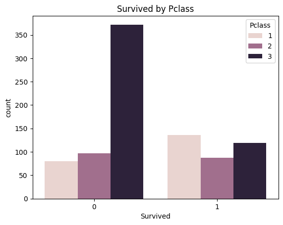
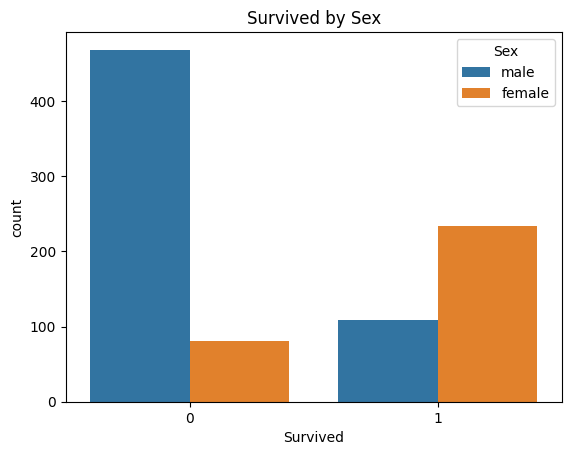
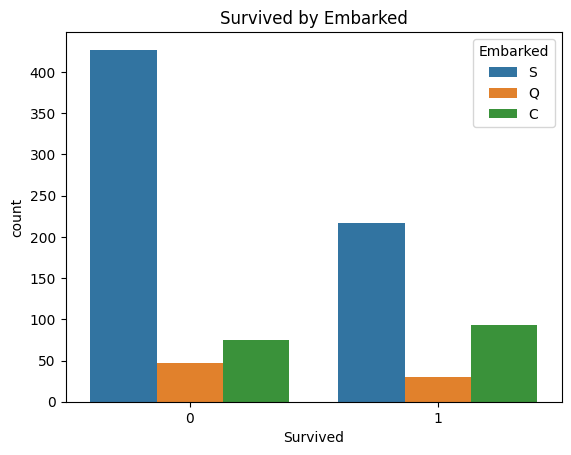
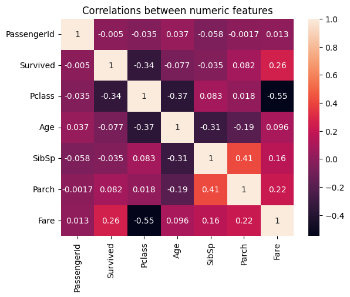

# 🚢 gtc_ml_project2_Titanic_dataset

---

This is my **second project** during the **GTC Internship**.  
The **main goal** of this project was to perform **Exploratory Data Analysis (EDA)** on the Titanic dataset to uncover insights about survival patterns.  

After completing the EDA, I extended the project by experimenting with different machine learning models to predict survival.  

---

## 📊 Dataset Overview
- **Target Variable:** `Survived` (0 = Did not survive, 1 = Survived)  
- **Features:** `Pclass`, `Name`, `Sex`, `Age`, `SibSp`, `Parch`, `Ticket`, `Fare`, `Cabin`, `Embarked`  

---

## 🛠️ Steps in the Project
1. **Data Cleaning** (handle missing values, encode categorical features)  
2. **EDA** (survival rates by gender, class, age, etc.)  
3. **Feature Engineering** (Family size, extracting titles from names)  
4. **Model Training** (Perceptron, Logistic Regression, Random Forest,DecisionTreeClassifier, XGBoost, AdaBoostClassifier ,KNeighborsClassifier, CatBoostClassifier and lightGBMC)  
5. **Evaluation** (Accuracy ,confusion matrix, Precision, Recall, F1-score, and ROC-AUC.)  

---

## 🚀 Results 
- AdaBoostClassifier  performed well with ensemble learning.  
- **Support Vector Classifier (SVC)** achieved the **best result with 83% accuracy without any hyperparameter tuning.** 🎯  

---

## 📊 Visualizations

### 1. Survival by Passenger Class (Pclass)  
  
- Higher survival rate among passengers in **1st class** compared to 2nd and 3rd.

---

### 2. Survival by Sex  
  
- **Females had a much higher survival rate** than males.

---

### 3. Survival by Embarkation Port (Embarked)  
  
- Passengers from Southampton (S) had relatively higher survival rates.

---

### 4. Correlation Heatmap  
  
- **Fare** and **Pclass** are negatively correlated.  
- **Survival** is positively correlated with **Fare**, negatively with **Pclass**.

---

## 💡 Key Learnings
- EDA is crucial for understanding survival factors. 
- Feature engineering can significantly boost model performance.  
- Even without tuning, **SVC outperformed other models** in this project.  
- Gender and passenger class were the most important predictors of survival.  

---

## 📝 Author
👤 **Abanoub Michel**  
📍 Machine Learning Intern @ GTC  
